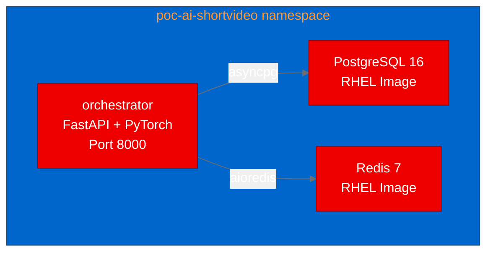

## What is myAiVideos?

[myAiVideos](https://github.com/myccarl/ai-shortVideo-pipeline) is an open-source, end-to-end automated short-video production pipeline. It coordinates multiple AI models across a seven-layer architecture: topic discovery, creative generation, visuals, audio, post-production, distribution, and optimization. The orchestration core runs on FastAPI with async Python, backed by PostgreSQL for state management and Redis for job queuing.

The project includes a Java Spring Boot gateway for authentication, rate limiting, and multi-model failover with Resilience4j, making it architecturally closer to enterprise patterns than most AI demo projects. We set out to validate whether this complex multi-model pipeline could be containerized with UBI images and deployed on Red Hat OpenShift.

## Why multi-model orchestration matters

Most AI demos showcase a single model behind an API. Production AI systems look different: they coordinate multiple specialized models, handle failover between providers, gate quality at each stage, and track costs across the pipeline. myAiVideos does exactly this, routing between DeepSeek, Qwen, and GLM for text generation, Kling for video, and Volcengine for TTS.

Deploying this pattern on Red Hat OpenShift AI validates that the platform can host not just model serving but the orchestration layer that ties models together into business workflows.

## Containerizing a Python ML pipeline with UBI

The original Dockerfile uses Chinese mirror repositories for pip and apt. Our UBI conversion replaced these with standard sources and handled several RHEL-specific challenges.

The main Dockerfile targets the orchestrator:

```dockerfile
FROM registry.access.redhat.com/ubi9/python-312

WORKDIR /opt/app-root/src

USER 0
RUN dnf install -y \
    https://dl.fedoraproject.org/pub/epel/epel-release-latest-9.noarch.rpm && \
    /usr/bin/crb enable && \
    dnf install -y libsndfile && \
    dnf clean all
USER 1001

COPY requirements.txt .
RUN pip install --no-cache-dir --timeout 120 \
    'torch>=2.0,<3' --extra-index-url https://download.pytorch.org/whl/cpu
RUN pip install --no-cache-dir --timeout 120 -r requirements.txt
```

Key decisions:

- **CPU-only torch**: The orchestrator doesn't run inference locally. AI model calls go through external APIs. Using `--extra-index-url https://download.pytorch.org/whl/cpu` keeps the image under 2GB instead of the CUDA-bundled 4GB+.
- **EPEL for system libraries**: `libsndfile` for audio processing comes from UBI AppStream. `ffmpeg-free` has unresolvable `libSDL2` dependencies in EPEL for RHEL 9, which we handled gracefully.
- **Hardcoded paths**: The application references `/app/output` and `/app/logs` directories. We created these in the Dockerfile with proper ownership for UID 1001.

## Deploying the stack

The deployment includes three components: the FastAPI orchestrator, PostgreSQL 16, and Redis 7, all using RHEL images for OpenShift compatibility.



One lesson: RHEL Redis images require a non-empty `REDIS_PASSWORD`. Setting an empty password or omitting it causes the container to crash on startup with "Invalid password." The fix is straightforward but undocumented enough to catch you off guard.

## Test results

| Scenario | Result | Response Time |
|---|---|---|
| Swagger UI at /docs | PASS | 0.02s |
| OpenAPI Schema at /openapi.json | PASS | 0.06s |

The API serves a complete OpenAPI schema with endpoints for storyboard management, clip regeneration, and webhook processing. The seven-layer pipeline framework initializes with 9 style templates loaded on startup.

## Lessons learned

**CPU torch is sufficient for orchestration layers.** When the application delegates inference to external APIs, pulling the CPU-only torch variant saves gigabytes of image size without sacrificing functionality. The `faster-whisper` and `ctranslate2` packages also install cleanly in CPU mode on UBI9.

**RHEL infrastructure images have specific requirements.** Both PostgreSQL (`POSTGRESQL_USER` must not be "postgres") and Redis (`REDIS_PASSWORD` must not be empty) have constraints that differ from their upstream Docker Hub equivalents.

**EPEL on UBI9 has gaps.** `ffmpeg-free` cannot be installed due to missing `libSDL2` in the available repositories. For PoC validation this is acceptable, but production deployments would need a custom RPM build or a sidecar approach.

## Try it yourself

- **Fork:** [aicatalyst-team/ai-shortVideo-pipeline](https://github.com/aicatalyst-team/ai-shortVideo-pipeline)
- **Image:** `quay.io/aicatalyst/ai-shortvideo-pipeline:latest`
- **Manifests:** [`kubernetes/`](https://github.com/aicatalyst-team/ai-shortVideo-pipeline/tree/main/kubernetes)
- **Report:** [`poc-report.md`](https://github.com/aicatalyst-team/ai-shortVideo-pipeline/blob/autopoc-artifacts/poc-report.md)
