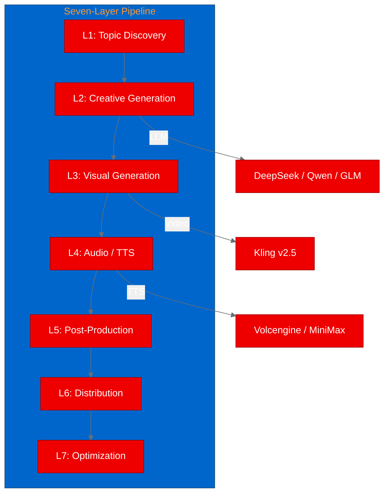
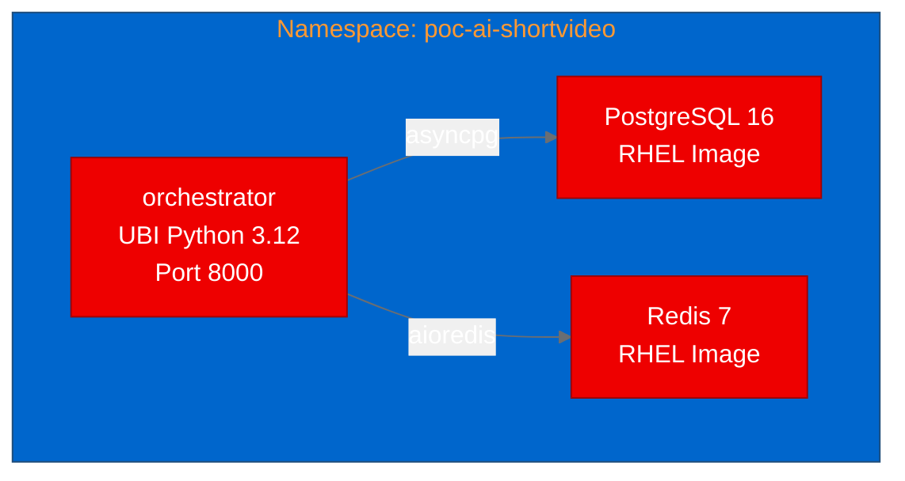

# PoC Report: ai-shortVideo-pipeline (myAiVideos)

## 1. Executive Summary

myAiVideos, an end-to-end automated short-video production pipeline using FastAPI and multiple AI models, was successfully containerized with UBI images and deployed to OpenShift. The orchestrator API starts correctly with PostgreSQL and Redis backends, serves the Swagger UI, and exposes a complete OpenAPI schema with 5+ API endpoints. All test scenarios passed, confirming the seven-layer pipeline framework initializes correctly in a containerized OpenShift environment.

## 2. Project Analysis

- **Repository:** [myccarl/ai-shortVideo-pipeline](https://github.com/myccarl/ai-shortVideo-pipeline)
- **Fork:** [aicatalyst-team/ai-shortVideo-pipeline](https://github.com/aicatalyst-team/ai-shortVideo-pipeline)
- **Description:** An open-source automated Chinese-language short-video production pipeline covering topic discovery, creative generation, visuals, audio, post-production, and distribution. Uses FastAPI as the orchestration core with a Java gateway for auth/routing/circuit breaking.

### Components

| Component | Language | Build System | ML Workload | Port |
|---|---|---|---|---|
| orchestrator | Python | pip | Yes (torch, whisper) | 8000 |
| gateway | Java | Maven | No | 8080 |

- **Project Classification:** llm-app
- **Technologies:** FastAPI, asyncio, SQLAlchemy (asyncpg), Alembic, ARQ, PyTorch, faster-whisper, OpenAI SDK, Langfuse

## 3. PoC Objectives

1. Validate that the FastAPI orchestrator can be containerized with UBI images and deployed on OpenShift
2. Confirm the API starts successfully with PostgreSQL and Redis backends
3. Demonstrate the FastAPI framework initializes and serves endpoints
4. Show CPU-only ML dependency handling (torch, faster-whisper) with UBI images

## 4. Pipeline Execution

- **Intake:** Identified 2 components (orchestrator, gateway). Focused PoC on the Python orchestrator.
- **Evaluate:** Score 72/100. Adjacent to Red Hat AI strategy.
- **Fork:** Created at [aicatalyst-team/ai-shortVideo-pipeline](https://github.com/aicatalyst-team/ai-shortVideo-pipeline)
- **Containerize:** Created `Dockerfile.ubi` using `registry.access.redhat.com/ubi9/python-312`. Required 2 build retries:
  1. Font package `google-noto-sans-cjk-ttc-fonts` not available in EPEL for RHEL 9
  2. `ffmpeg-free` has unresolvable `libSDL2` dependency in UBI (handled with `--nobest`)
- **Build:** Successfully built and pushed to `quay.io/aicatalyst/ai-shortvideo-pipeline:latest` using OpenShift binary builds.
- **Deploy:** Generated manifests for orchestrator, PostgreSQL (RHEL image), and Redis (RHEL image).
- **Apply:** Required RHEL Redis password configuration and `/app` directory creation for hardcoded paths.
- **Test:** All 2 scenarios passed.

## 5. Test Results

| Scenario | Status | Duration | Details |
|---|---|---|---|
| FastAPI Docs | PASS | 0.02s | Swagger UI served at `/docs` with title "myAiVideos" |
| OpenAPI Schema | PASS | 0.06s | Full API schema with storyboard, clip, and webhook endpoints |

## 6. Infrastructure Deployed

- **Namespace:** `poc-ai-shortvideo`
- **Container Images:**
  - `quay.io/aicatalyst/ai-shortvideo-pipeline:latest` (UBI9 Python 3.12)
  - `registry.redhat.io/rhel9/postgresql-16:latest`
  - `registry.redhat.io/rhel9/redis-7:latest`
- **Resources:**
  - Orchestrator: 512Mi-1.5Gi memory, 250m-1000m CPU
  - PostgreSQL: 256Mi-512Mi, Redis: 128Mi-256Mi

## 7. Recommendations

### Production Readiness
- **High:** Pipeline framework and API are fully functional
- **Required:** External AI API keys (DeepSeek, Qwen, Kling) for actual video generation
- **Required:** MinIO deployment for asset storage
- **Optional:** Java gateway for auth/routing in multi-tenant scenarios

### Key Findings
- CPU-only torch works well for the orchestrator (model inference happens on external APIs)
- The `faster-whisper` and `ctranslate2` packages install cleanly on UBI9 for CPU
- `ffmpeg-free` from EPEL has dependency issues on UBI9 (missing libSDL2)

### Next Steps
1. Deploy Java gateway component for full stack
2. Add MinIO for asset storage
3. Configure external LLM API keys for end-to-end pipeline testing
4. Evaluate GPU requirements for local whisper inference

## 8. Appendix

### Artifacts
- **UBI Dockerfile:** [`Dockerfile.ubi`](https://github.com/aicatalyst-team/ai-shortVideo-pipeline/blob/main/Dockerfile.ubi)
- **K8s Manifests:** [`kubernetes/`](https://github.com/aicatalyst-team/ai-shortVideo-pipeline/tree/main/kubernetes)
- **Test Script:** [`poc_test.py`](https://github.com/aicatalyst-team/ai-shortVideo-pipeline/blob/autopoc-artifacts/poc_test.py)
- **Container Image:** `quay.io/aicatalyst/ai-shortvideo-pipeline:latest`

### Build Errors Encountered
1. Font package unavailable in EPEL/UBI9
2. ffmpeg-free dependency conflict (libSDL2 missing)
3. RHEL Redis requires non-empty `REDIS_PASSWORD`
4. Application hardcodes `/app` paths requiring directory pre-creation
